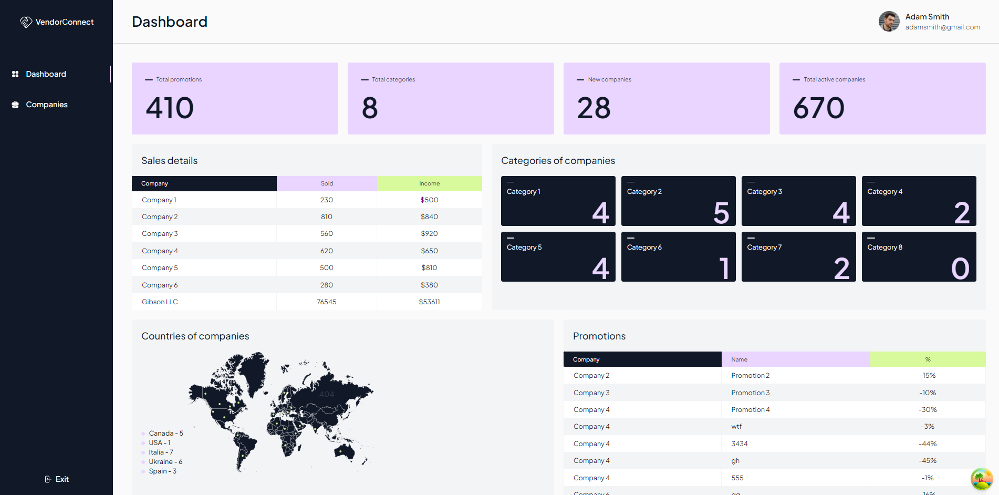

# Vendor Connect

Vendor Connect is a web application for managing company promotions and tracking sales. The application allows users to
view dashboard statistics, manage company data, monitor promotions, and add new companies.

## Dashboard Preview

Here is a preview of the Dashboard page, showcasing the application's key features:



## Features

| Section                | Description                                                                                   |
|------------------------|-----------------------------------------------------------------------------------------------|
| **Dashboard**          | View the total number of promotions, categories, new and active companies, and sales details. |
| **Company Management** | List and manage companies, including their status, promotions, and countries.                 |
| **Promotion Tracking** | Monitor promotions belonging to specific companies.                                           |
| **Add Company**        | Create and manage new companies, including their details, status, and associated promotions.  |

## Installation

To get started with Vendor Connect, follow these steps:

1. **Clone the repository:**

   ```bash
   git clone https://github.com/yourusername/vendor-connect.git
   ```

2. **Install dependencies:**

   ```bash
   yarn install
   ```

## Development

To start the development server, run:

```bash
yarn dev
```

This will start the application in development mode, and you can access it at `http://localhost:3000`.

## Production Build

To create an optimized production build, run:

```bash
yarn build
```

To start the application in production mode, use:

```bash
yarn start
```

## API Overview

Vendor Connect uses a set of APIs to manage companies, promotions, and related data. Below is a summary of the available
API endpoints:

### Summary Stats

- **Endpoint:** `/summary-stats/1`
- **Description:** Fetches summary statistics, including the total number of promotions, categories, new companies, and
  active companies.

### Summary Sales

- **Endpoint:** `/summary-sales`
- **Description:** Retrieves sales data, including company sales and income information.

### Countries

- **Endpoint:** `/countries`
- **Description:** Retrieves a list of countries.

### Categories

- **Endpoint:** `/categories`
- **Description:** Retrieves a list of categories.

### Companies

- **Endpoint:** `/companies`
- **Description:** Retrieves a list of companies or a specific company by ID.
- **Methods:**
    - `GET`: Fetch all companies or a specific company.
    - `POST`: Create a new company. Required fields
      include `title`, `description`, `status`, `joinedDate`, `categoryId`, and `countryId`.

### Promotions

- **Endpoint:** `/promotions`
- **Description:** Retrieves a list of promotions or creates a new promotion.
- **Methods:**
    - `GET`: Fetch promotions, filtered by company if needed.
    - `POST`: Create a new promotion. Required fields include `title`, `description`, `discount`, and `companyId`.

## Contributing

Contributions are welcome! Please follow these guidelines for contributing:

1. Fork the repository.
2. Create a new branch (`git checkout -b feature/your-feature`).
3. Make your changes.
4. Commit your changes (`git commit -am 'Add new feature'`).
5. Push to the branch (`git push origin feature/your-feature`).
6. Create a new Pull Request.

## Contact

For any questions or suggestions, please contact:

- **Email:** olenavasylchuk.front@gmail.com
- **GitHub:** [Olena-P](https://github.com/Olena-P)
